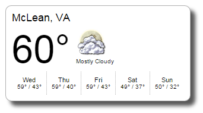

## WeatherWidget

A simple weather widget using jQuery.



## Example

```html
<body>
    <div id="weather-widget"></div>
</body>
```

```js
$(document).ready(function () {
    $('#weather-widget').weatherWidget({
        zipCode: '22102'
    });
});
```

# Installation

```html
<link href="weatherWidget.min.css" rel="stylesheet" />
<script src="http://ajax.googleapis.com/ajax/libs/jquery/1.7.1/jquery.min.js"></script>
<script src="weatherWidget.min.js"></script>
```
